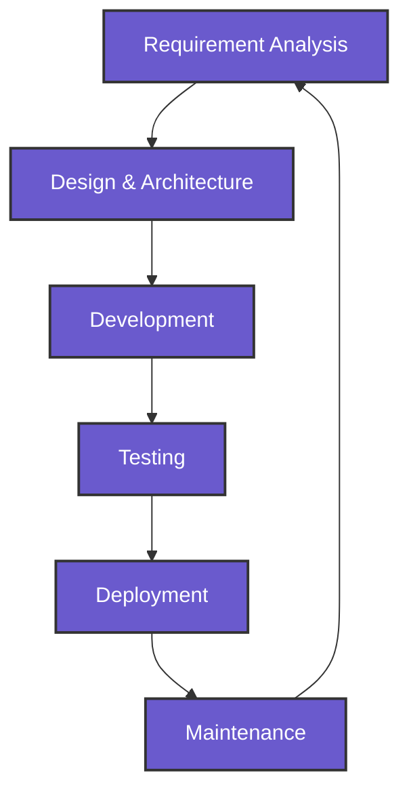

  

  

  

    
    
    
    
    
  

  
  

 

<!-- Tech Stack Section with Modern Layout -->
<h2 align="center">
   
  Tech Stack
</h2>

  <table>
    <tr>
      <td valign="top" width="33%">
        <h3 align="center">Frontend</h3>
        

          
        

      </td>
      <td valign="top" width="33%">
        <h3 align="center">Backend</h3>
        

          
        

      </td>
      <td valign="top" width="33%">
        <h3 align="center">DevOps & Cloud</h3>
        

          
        

      </td>
    </tr>
    <tr>
      <td valign="top" width="33%">
        <h3 align="center">Mobile</h3>
        

          
        

      </td>
      <td valign="top" width="33%">
        <h3 align="center">Database</h3>
        

          
        

      </td>
      <td valign="top" width="33%">
        <h3 align="center">Tools</h3>
        

          
        

      </td>
    </tr>
  </table>

 

<!-- About Me Section with Modern Design -->

  

<h2 align="center">
   
  About Me
</h2>

  
  
  

    <ul style="list-style-type: none; padding-left: 0;">
      <li>🔭 I'm currently working on <b>React websites and Shopify projects</b></li>
      <li>🌱 I'm currently learning <b>Next.js, GraphQL, GCP, Advanced Java, and Angular</b></li>
      <li>👯 I'm looking to collaborate on <b>Exciting web development projects</b></li>
      <li>💬 Ask me about <b>React, Java, Android Development, or Custom ROMs</b></li>
      <li>📫 How to reach me: <b>anilshebin@gmail.com</b></li>
      <li>⚡ Fun fact: <b>I love diving into the depths of custom Android ROMs and tweaking every detail for the perfect user experience!</b></li>
    </ul>
  

 

<!-- GitHub Stats Section with Modern Cards -->

  

<h2 align="center">
   
  GitHub Stats
</h2>

  
  

  

 

<!-- Contribution Graph with Modern Design -->

  

<h2 align="center">
   
  Contribution Graph
</h2>

  

 

<!-- Professional Journey with Modern Timeline -->

  

<h2 align="center">
   
  Professional Journey
</h2>

  <table>
    <tr>
      <td>
        

          
          <h3>Android Developer</h3>
          
Mobile Apps Studio

          
<i>2017 - 2019</i>

          
Developed custom Android applications and ROMs

        

      </td>
      <td>
        

          
          <h3>Frontend Developer</h3>
          
Creative Web Agency

          
<i>2019 - 2021</i>

          
Built responsive web applications using React

        

      </td>
    </tr>
    <tr>
      <td>
        

          
          <h3>Full Stack Developer</h3>
          
Digital Solutions Ltd.

          
<i>2021 - 2023</i>

          
Developed full-stack applications with Java and React

        

      </td>
      <td>
        

          
          <h3>Senior Full Stack Developer</h3>
          
Tech Innovators Inc.

          
<i>2023 - Present</i>

          
Leading development teams and architecting solutions

        

      </td>
    </tr>
  </table>

 

<!-- Featured Projects with Modern Cards -->

  

<h2 align="center">
   
  Featured Projects
</h2>

  
  

 

<!-- Workflow Section with Modern Design -->

  

<h2 align="center">
   
  My Development Workflow
</h2>

` ``<!-- Trophies Section with Modern Design -->``

  

``<h2 align="center">
   
  GitHub Trophies
</h2>``

  

`` ``<!-- Contribution Snake Section -->``

  

``<h2 align="center">
   
  Contribution Snake
</h2>``

  <picture>
    <source media="(prefers-color-scheme: dark)" srcset="https://raw.githubusercontent.com/anilshebin/anilshebin/output/github-contribution-grid-snake-dark.svg">
    <source media="(prefers-color-scheme: light)" srcset="https://raw.githubusercontent.com/anilshebin/anilshebin/output/github-contribution-grid-snake.svg">
    
  </picture>

`` ``<!-- Support Section with Modern Design -->``

  

``<h2 align="center">
   
  Support My Work
</h2>``

  
  

`` ``<!-- Quote Section -->``

  

`` ``<!-- Footer Section with Modern Design -->``

  

