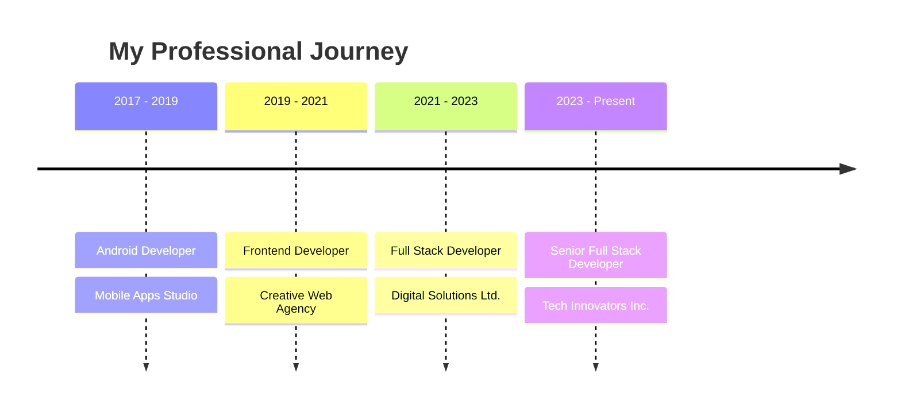

  

<h1 align="center">Hi , I'm Anil Shebin</h1>

  

  
🌟 <b>Passionate Full Stack Developer from India | Expertise in Java, React, and Android ROMs</b> 🌟

  
  

    
    
    
    
    
  

  

<!-- About Me Section -->
<h2 align="center">
   
  About Me
</h2>

- 🔭 I'm currently working on **React websites and Shopify projects**
- 🌱 I'm currently learning **Next.js, GraphQL, GCP, Advanced Java, and Angular**
- 👯 I'm looking to collaborate on **Exciting web development projects**
- 📫 How to reach me **anilshebin@gmail.com**
- ⚡ Fun fact **I love diving into the depths of custom Android ROMs and tweaking every detail for the perfect user experience!**

 
 

<!-- Skills Section -->
<h2 align="center">
   
  Skills & Technologies
</h2>

  
<b>Frontend</b>

   
  

    
    
    
    
    
    
    
    
    
    
  

  
<b>Backend</b>

   
  

    
    
    
    
    
    
  

  
<b>Mobile</b>

   
  

    
    
    
  

  
<b>Database</b>

   
  

    
    
    
    
  

  
<b>Cloud & DevOps</b>

   
  

    
    
    
    
    
    
    
    
    
  

  
<b>Tools & Others</b>

   
  

    
    
    
    
    
    
    
  

<!-- GitHub Stats Section -->
<h2 align="center">
   
  GitHub Stats
</h2>

  
  

  

<!-- Git Trophies Section -->
<h2 align="center">
   
  Git Trophies
</h2>

  

<!-- Featured Projects Section -->
<h2 align="center">
   
  Featured Projects
</h2>

  
  

<!-- Experience Timeline Section -->
<h2 align="center">
   
  Experience Timeline
</h2>

<!-- Activity Graph Section -->``<h2 align="center">
   
  Activity
</h2>``

  

``<!-- Top Contributed Repos Section -->``<h2 align="center">
   
  Top Contributed Repos
</h2>``

  

``<!-- Contribution Snake Section -->``<h2 align="center">
   
  Contribution Snake
</h2>``

  

``<!-- Visitor Count Section -->``<h2 align="center">
   
  Visitor Count
</h2>``

  

``<!-- Support Section -->``<h2 align="center">
   
  Support My Work
</h2>``

  
  

``<!-- Footer Section -->``

  

